<h1><a href="https://www.curseforge.com/hytale/mods/clubs-reworked" target="_blank" style="color: #ffffff; text-decoration: none">Clubs and Flails</a></h1><h2 style="color: #eccafa; font-weight: bold;">Introduces clubs and flails as new weapon types usable by the player.</h2>

Previously, clubs and rusty flails only were usable by mobs, and spawning them in creative mode had limited usage — no blocking and no signature move.

This mod aims to change that, while also introducing the <b style="color: #eccafa;">full progression line of flails.</b>

***

## **Overview**

This mod introduces two new weapons; <b style="color: #eccafa;">clubs</b> and <b style="color: #eccafa;">flails</b>. They are new <b style="color: #eccafa;">one-handed melee weapons</b> with:

*   A unique attack pattern
*   Charged attack
*   Signature move

## **Current Status (Version 1.7.4)**

<h3 style="color: #fff;">The following clubs are implemented:</h3>

    <ul style="display:flex; flex-flow: column;">
        <li style="display:flex; flex-flow: row nowrap; align-items: center;">
            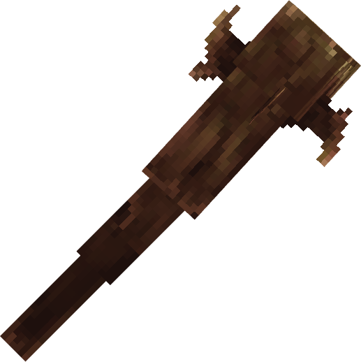
            Crude Club
        </li>
        <li style="display:flex; flex-flow: row nowrap; align-items: center;">
            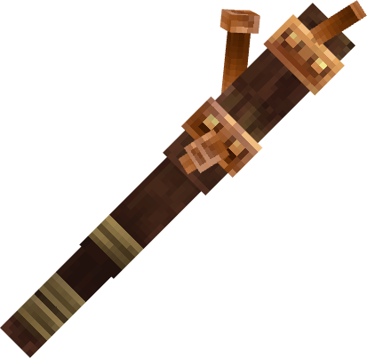
            Copper Club
        </li>
        <li style="display:flex; flex-flow: row nowrap; align-items: center;">
            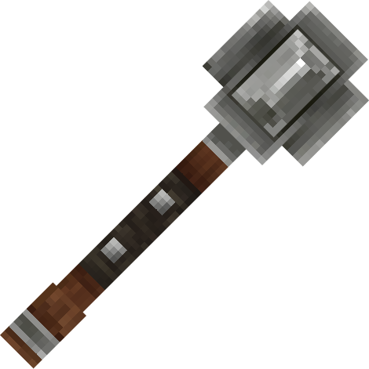
            Iron Club
        </li>
        <li style="display:flex; flex-flow: row nowrap; align-items: center;">
            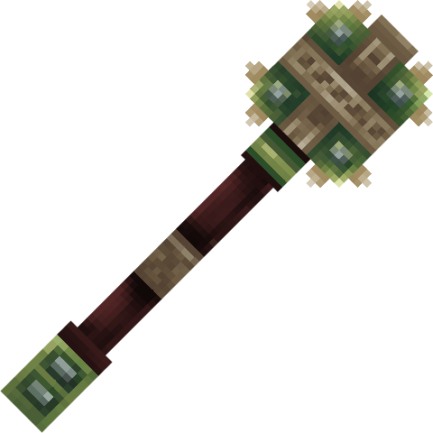
            Thorium Club
        </li>
        <li style="display:flex; flex-flow: row nowrap; align-items: center;">
            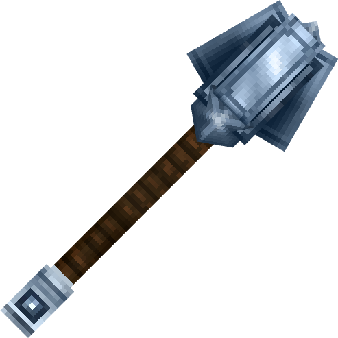
            Cobalt Club
        </li>       
        <li style="display:flex; flex-flow: row nowrap; align-items: center;">
            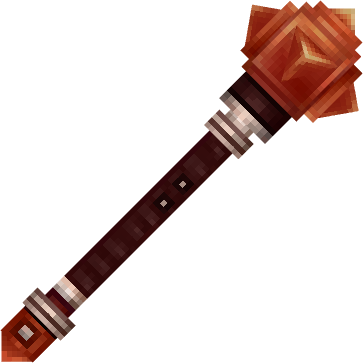
            Adamantite Club
        </li>    
        <li style="display:flex; flex-flow: row nowrap; align-items: center;">
            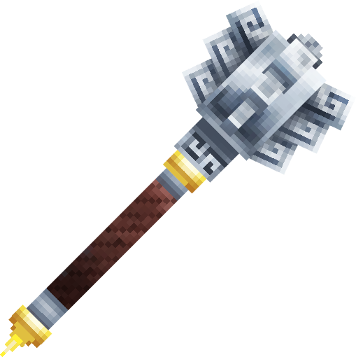
            Mithril Club
        </li>                                             
    </ul>

<h3 style="color: #fff;">The following flails are implemented:</h3>

    <ul style="display:flex; flex-flow: column;">
        <li style="display:flex; flex-flow: row nowrap; align-items: center;">
            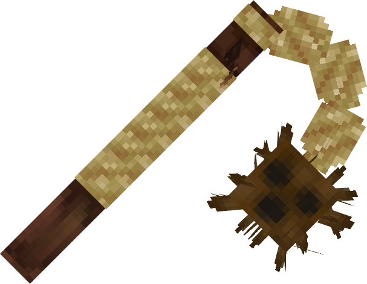
            Crude Flail
        </li>
        <li style="display:flex; flex-flow: row nowrap; align-items: center;">
            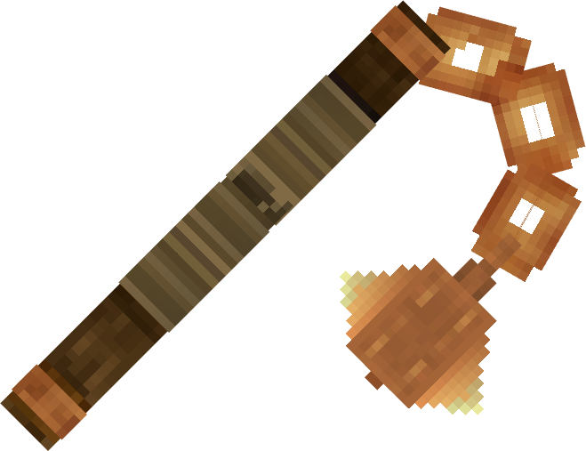
            Copper Flail
        </li>            
        <li style="display:flex; flex-flow: row nowrap; align-items: center;">
            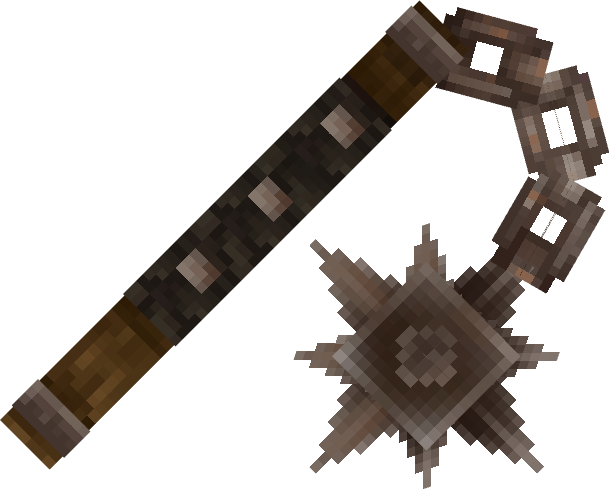
            Rusty Steel Flail
        </li>        
        <li style="display:flex; flex-flow: row nowrap; align-items: center;">
            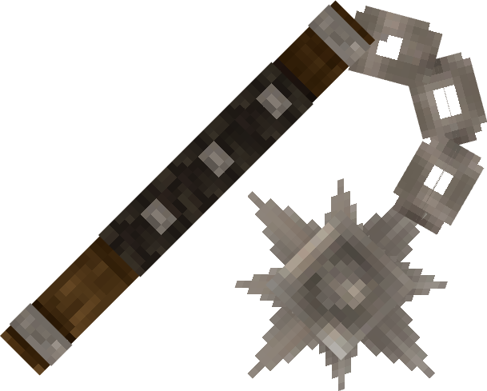
            Iron Flail            
        </li>
        <li style="display:flex; flex-flow: row nowrap; align-items: center;">
            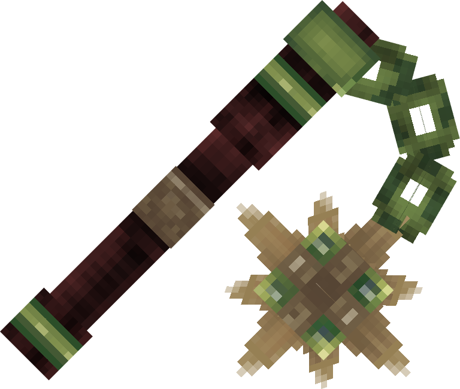
            Thorium Flail
        </li>
        <li style="display:flex; flex-flow: row nowrap; align-items: center">
            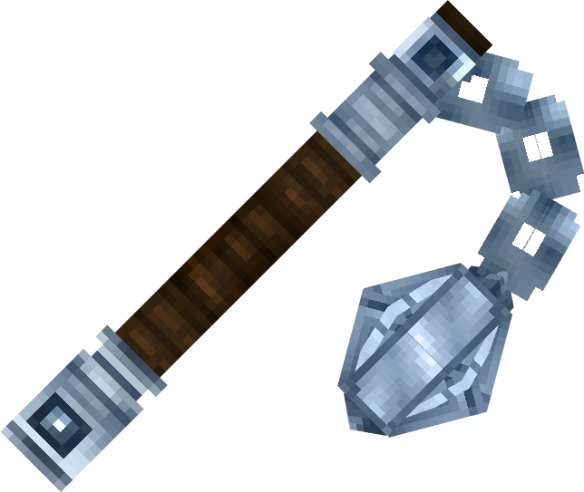
            Cobalt Flail
        </li>              
        <li style="display:flex; flex-flow: row nowrap; align-items: center">
            
            Adamantite Flail
        </li>                                 
    </ul>

<h4 style="color: #eccafa;">The crude club and flail are craftable without a workbench.</h4>

The other clubs and flails are craftable in the blacksmith's bench─found under the "maces" category─with tier requirements following with their rarity.

***

## **Clubs Planned for Implementation**

*   Rusty Iron Club
*   Onyxium Club
*   Scrap Club
*   Tribal Club
*   Stone Trork Club
*   Doomed Outlander Club

***

## **Plans**

*   Implement the clubs that are unique to mobs, and add them to their drop tables.
*   <s>Implement tiered versions of the flail.</s>

***

## <strong>Compatibility</strong>

If you notice any incompatibility with any other mods, please let me know, and I can see what I can do!
